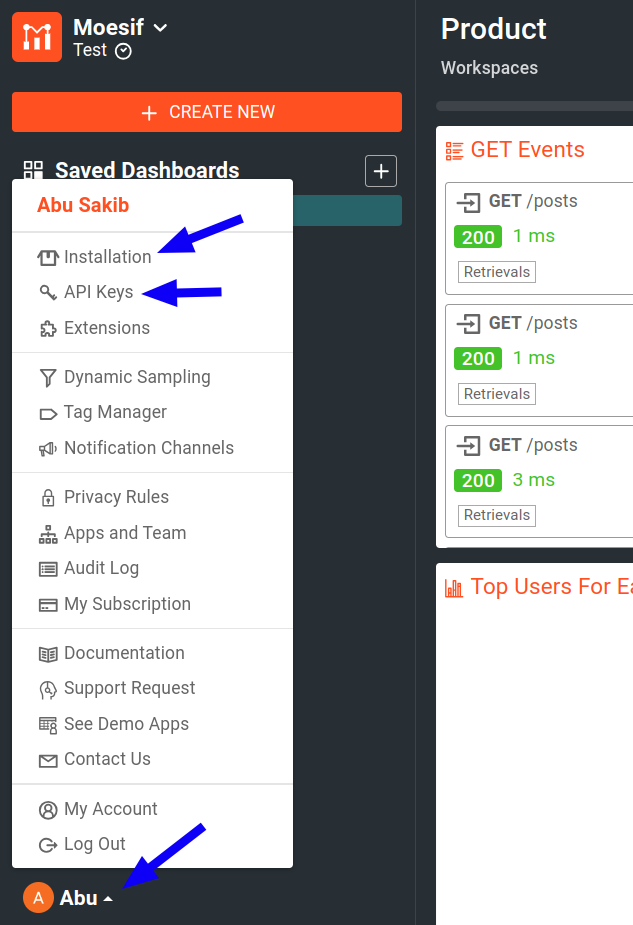

# Moesif AWS Lambda Middleware for Node.js documentation
by [Moesif](https://moesif.com), the [API analytics](https://www.moesif.com/features/api-analytics) and [API monetization](https://www.moesif.com/solutions/metered-api-billing) platform.

[](https://nodei.co/npm/moesif-aws-lambda/)

[![Built For][ico-built-for]][link-built-for]
[![Software License][ico-license]][link-license]
[![Source Code][ico-source]][link-source]

With Moesif Node.js middleware for AWS Lambda, you can automatically log API calls
and send them to [Moesif](https://www.moesif.com) for API analytics and monitoring.
This middleware allows you to integrate Moesif's API analytics and
API monetization features into your Node.js applications with minimal configuration.

> If you're new to Moesif, see [our Getting Started](https://www.moesif.com/docs/) resources to quickly get up and running.

## Who This Middleware is For

We've designed Moesif Node.js middleware for AWS Lambda for APIs that you host
on AWS Lambda using Amazon API Gateway or Application Load Balancer
as a trigger. The middleware works with REST APIs, [GraphQL APIs](https://www.moesif.com/features/graphql-analytics)
([such as with `apollo-server-lambda`](https://github.com/Moesif/moesif-aws-lambda-apollo-example)), and more.

If you're running a Node.js framework like Express.js on AWS Lambda and prefer to not have any
AWS-specific dependencies, Moesif also has a <a href="https://www.moesif.com/docs/server-integration/nodejs/">Node.js middleware</a> available. The Node.js middleware supports all Node.js frameworks, including Express.js.
However, the Node.js middleware doesn't capture Lambda-specific context like trade ID.

## Prerequisites
Before using this middleware, make sure you have the following:

- [An active Moesif account](https://moesif.com/wrap)
- [A Moesif Application ID](#get-your-moesif-application-id)

### Get Your Moesif Application ID
After you log into [Moesif Portal](https://www.moesif.com/wrap), you can get your Moesif Application ID during the onboarding steps. You can always access the Application ID any time by following these steps from Moesif Portal after logging in:

1. Select the account icon to bring up the settings menu.
2. Select **Installation** or **API Keys**.
3. Copy your Moesif Application ID from the **Collector Application ID** field.


## Install the middleware
In your project directory, install the middleware as a project dependency:

```shell
npm install --save moesif-aws-lambda
```

## Configure the Middleware
See the available [configuration options](#configuration-options) to learn how to configure the middleware for your use case.

## How to use

### 1. Import the Module and Initialize


```javascript
// Import Modules
'use strict'
const moesif = require('moesif-aws-lambda');

const moesifOptions = {
    applicationId: 'YOUR_MOESIF_APPLICATION_ID',

    identifyUser: function (event, context) {
        return event.requestContext.identity.cognitoIdentityId
    },
    identifyCompany: function (event, context) {
        return '5678'
    }
};

exports.handler = function (event, context, callback) {
    callback(null, {
        statusCode: '200',
        body: JSON.stringify({key: 'hello world'}),
        headers: {
            'Content-Type': 'application/json',
        },
    });
};

exports.handler = moesif(moesifOptions, exports.handler);
```

Replace *`YOUR_MOESIF_APPLICATION_ID`* with [your Moesif Application ID](#get-your-moesif-application-id).

Depends on the version of Node.js, you can also import directly:

```javascript
import moesif from 'moesif-aws-lambda'
```

If you are using ECMAScript modules (ES modules) or later version of ES modules, try the following method:

```javascript
const moesifImportWrapper = await import('moesif-aws-lambda');
const moesif = moesifImportWrapper.default;
```

### 2. Enter Your Moesif Application ID
The middleware expects your Moesif Application ID in [the `applicationId` key of the Moesif initialization options object](https://github.com/Moesif/moesif-aws-lambda-nodejs/blob/89c384621f8ae5fcee9166d798feb1e3115459ae/app.js#L13).

For instructions on how to obtain your Application ID, see [Get your Moesif Application ID](#get-your-moesif-application-id).

You can hardcode your Moesif Application ID value in `applicationId`. But we highly recommend that you use a more secure option like environment variables to store your Application ID. If you set the environment variable as `MOESIF_APPLICATION_ID`, Moesif automatically picks it up without you having to explicitly specify it in the `applicationId` key.

### 3. Call Your API

Finally, grab the URL to your API Gateway or Application Load Balancer and make some HTTP requests using a tool like Postman or cURL.

> In order for your events to log to Moesif, you must test using the Amazon API Gateway trigger. Do not invoke your Lambda directly using AWS Console as the payload won't contain a valid HTTP payload.

## Troubleshoot
For a general troubleshooting guide that can help you solve common problems, see [Server Troubleshooting Guide](https://www.moesif.com/docs/troubleshooting/server-troubleshooting-guide/).

Other troubleshooting supports:

- [FAQ](https://www.moesif.com/docs/faq/)
- [Moesif support email](mailto:support@moesif.com)


## Repository Structure

```
.
├── app.js
├── images/
├── lib/
├── LICENSE
├── package.json
├── package-lock.json
├── README.md
└── tests/
```

These are the most important files:

- **`lib/index.js`**: the middleware library
- **`app.js`**: sample AWS Lambda function using the middleware


## Configuration Options
The following sections describe the available configuration options for this middleware. You can set these options in the Moesif initialization options object. See [the sample AWS Lambda middleware function code](https://github.com/Moesif/moesif-aws-lambda-nodejs/blob/89c384621f8ae5fcee9166d798feb1e3115459ae/app.js#L15) for an example.

### `logBody`
<table>
  <tr>
   <th scope="col">
    Data type
   </th>
   <th scope="col">
    Default
   </th>
  </tr>
  <tr>
   <td>
    <code>Boolean</code>
   </td>
   <td>
    <code>true</code>
   </td>
  </tr>
</table>
Whether to log request and response body to Moesif.

### `identifyUser`

<table>
  <tr>
   <th scope="col">
    Data type
   </th>
   <th scope="col">
    Parameters
   </th>
   <th scope="col">
    Return type
   </th>
  </tr>
  <tr>
   <td>
    Function
   </td>
   <td>
    <code>(event, context)</code>
   </td>
   <td>
    <code>String</code>
   </td>
  </tr>
</table>

A function that takes AWS lambda `event` and `context` objects as arguments
and returns a user ID. This allows Moesif to attribute API requests to individual unique users
so you can understand who is calling your API. You can use this simultaneously with [`identifyCompany`](#identifycompany)
to track both individual customers and the companies they are a part of.


```javascript
options.identifyUser = function (event, context) {
  // your code here, must return a string
  return event.requestContext.identity.cognitoIdentityId
}
```

### `identifyCompany`
<table>
  <tr>
   <th scope="col">
    Data type
   </th>
   <th scope="col">
    Parameters
   </th>
   <th scope="col">
    Return type
   </th>
  </tr>
  <tr>
   <td>
    Function
   </td>
   <td>
    <code>(event, context)</code>
   </td>
   <td>
    <code>String</code>
   </td>
  </tr>
</table>

A function that takes AWS lambda `event` and `context` objects as arguments
and returns a company ID. If you have a B2B business, this allows Moesif to attribute
API requests to specific companies or organizations so you can understand which accounts are
calling your API. You can use this simultaneously with [`identifyUser`](#identifyuser) to track both
individual customers and the companies they are a part of.


```javascript
options.identifyCompany = function (event, context) {
  // your code here, must return a string
  return '5678'
}
```

### `getSessionToken`
<table>
  <tr>
   <th scope="col">
    Data type
   </th>
   <th scope="col">
    Parameters
   </th>
   <th scope="col">
    Return type
   </th>
  </tr>
  <tr>
   <td>
    Function
   </td>
   <td>
    <code>(event, context)</code>
   </td>
   <td>
    <code>String</code>
   </td>
  </tr>
</table>

A function that takes AWS lambda `event` and `context` objects as arguments and returns a
session token such as an API key.


```javascript
options.getSessionToken = function (event, context) {
  // your code here, must return a string.
  return event.headers['Authorization'];
}
```

### `getApiVersion`
<table>
  <tr>
   <th scope="col">
    Data type
   </th>
   <th scope="col">
    Parameters
   </th>
   <th scope="col">
    Return type
   </th>
  </tr>
  <tr>
   <td>
    Function
   </td>
   <td>
    <code>(event, context)</code>
   </td>
   <td>
    <code>String</code>
   </td>
  </tr>
</table>

A function that takes AWS lambda `event` and `context` objects as arguments and
returns a string to tag requests with a specific version of your API.

```javascript
options.getApiVersion = function (event, context) {
  // your code here. must return a string.
  return '1.0.5'
}
```

### `getMetadata`
<table>
  <tr>
   <th scope="col">
    Data type
   </th>
   <th scope="col">
    Parameters
   </th>
   <th scope="col">
    Return type
   </th>
  </tr>
  <tr>
   <td>
    Function
   </td>
   <td>
    <code>(event, context)</code>
   </td>
   <td>
    <code>Object</code>
   </td>
  </tr>
</table>

A function that takes AWS lambda `event` and `context` objects as arguments and returns an object.

This function allows you
to add custom metadata that Moesif can associate with the request. The metadata must be a simple JavaScript object that can be converted to JSON.

For example, you may want to save a virtual machine instance ID, a trace ID, or a tenant ID with the request.


```javascript
options.getMetadata = function (event, context)  {
  // your code here:
  return {
    foo: 'custom data',
    bar: 'another custom data'
  };
}
```

### `skip`
<table>
  <tr>
   <th scope="col">
    Data type
   </th>
   <th scope="col">
    Parameters
   </th>
   <th scope="col">
    Return type
   </th>
  </tr>
  <tr>
   <td>
    Function
   </td>
   <td>
    <code>(event, context)</code>
   </td>
   <td>
    <code>Boolean</code>
   </td>
  </tr>
</table>

A function that takes AWS lambda `event` and `context` objects as arguments and returns `true`
if you want to skip the event. Skipping an event means Moesif doesn't log the event.

The following example skips requests to the root path `/`:

```javascript
options.skip = function (event, context) {
  // your code here. must return a boolean.
  if (event.path === '/') {
    // Skip probes to home page.
    return true;
  }
  return false
}
```

### `maskContent`
<table>
  <tr>
   <th scope="col">
    Data type
   </th>
   <th scope="col">
    Parameters
   </th>
   <th scope="col">
    Return type
   </th>
  </tr>
  <tr>
   <td>
    Function
   </td>
   <td>
    <code>(MoesifEventModel)</code>
   </td>
   <td>
    <code>MoesifEventModel</code>
   </td>
  </tr>
</table>

A function that takes the final Moesif event model, rather than the AWS lambda event or context objects, as an
argument before the middleware sends the event model object to Moesif.

With `maskContent`, you can make modifications to headers or body such as
removing certain header or body fields.

```javascript
options.maskContent = function(moesifEvent) {
  // remove any field that you don't want to be sent to Moesif.
  return moesifEvent;
}
 ```

Moesif's event model format looks like this:

```json
{
  "request": {
    "time": "2019-08-08T04:45:42.914",
    "uri": "https://api.acmeinc.com/items/83738/reviews/",
    "verb": "POST",
    "api_version": "1.1.0",
    "ip_address": "61.48.220.123",
    "headers": {
      "Host": "api.acmeinc.com",
      "Accept": "*/*",
      "Connection": "Keep-Alive",
      "Content-Type": "application/json",
      "Content-Length": "126",
      "Accept-Encoding": "gzip"
    },
    "body": {
      "items": [
        {
          "direction_type": 1,
          "item_id": "fwdsfrf",
          "liked": false
        },
        {
          "direction_type": 2,
          "item_id": "d43d3f",
          "liked": true
        }
      ]
    }
  },
  "response": {
    "time": "2019-08-08T04:45:42.924",
    "status": 500,
    "headers": {
      "Vary": "Accept-Encoding",
      "Pragma": "no-cache",
      "Expires": "-1",
      "Content-Type": "application/json; charset=utf-8",
      "Cache-Control": "no-cache"
    },
    "body": {
      "Error": "InvalidArgumentException",
      "Message": "Missing field location"
    }
  },
  "user_id": "my_user_id",
  "company_id": "my_company_id",
  "session_token":"end_user_session_token",
  "tags": "tag1, tag2"
}
```

For more information about the different fields of Moesif's event model,
see the following table or the [Moesif Node.js API documentation](https://www.moesif.com/docs/api?javascript).

Name | Required | Description
--------- | -------- | -----------
`request` | Yes | The object that specifies the API request.
`request.time`| Yes | Timestamp for the request in ISO 8601 format.
`request.uri`| Yes | Full URI such as `https://api.com/?query=string` including host, query string, and so on.
`request.verb`| Yes | The HTTP method—for example, `GET` and `POST`.
`request.api_version`| No | API Version you want to tag this request with such as `1.0.0`.
`request.ip_address`| No | IP address of the client. If not set, Moesif uses the IP address of your logging API calls.
`request.headers`| Yes | Headers of the  request as a `Map<string, string>` object. Multiple headers with the same key name should be combined together such that the values are joined by a comma. For more information, see [HTTP Header Protocol on w3.org](https://www.w3.org/Protocols/rfc2616/rfc2616-sec4.html#sec4.2)
`request.body`| No | Body of the request in JSON format or base64 encoded binary data. To specify the transfer encoding, use `request.transfer_encoding`.
`request.transfer_encoding`| No | A string that specifies the transfer encoding of the request body sent to Moesif. If not specified, Moesif assumes the request body assumed to be JSON or text. Only supported value is `base64` for sending binary data like protocol buffers.
||
`response` | No | The object that specifies the `response message`. If not set, it implies a null response such as a timeout.
`response.time`| Yes | Timestamp for the response in ISO 8601 format.
`response.status`| Yes | HTTP response status code number such as `200 OK` or `500 Internal Server Error`.
`response.ip_address`| No | IP address of the responding server.
`response.headers`| Yes | Headers of the response as a `Map<string, string>` object. Multiple headers with the same key name should be combined together such that the values are joined by a comma. For more information, see [HTTP Header Protocol on w3.org](https://www.w3.org/Protocols/rfc2616/rfc2616-sec4.html#sec4.2)
`response.body`| No | Body of the response in JSON format or base64 encoded binary data. To specify the transfer encoding, use `response.transfer_encoding`
`response.transfer_encoding`| No | A string that specifies the transfer encoding of the request body sent to Moesif. If not specified, Moesif assumes the body to be JSON or text. Only supported value is `base64` for sending binary data like protocol buffers.
||
`session_token` | Recommended | The end user session token such as a JWT or API key, which may or may not be temporary. Moesif automatically detects the session token if not set.
`user_id` | Recommended | Identifies this API call to a permanent user ID.
`metadata` | No | A JSON Object consisting of any custom metadata to be stored with this event.


### `debug`
<table>
  <tr>
   <th scope="col">
    Data type
   </th>
   <th scope="col">
    Default
   </th>
  </tr>
  <tr>
   <td>
    <code>Boolean</code>
   </td>
   <td>
    <code>undefined</code>
   </td>
  </tr>
</table>

Set to `true` to print debug logs if you're having integration issues.

## Capture Outgoing API Calls

If you want to capture all outgoing API calls from your Node.js app to third parties like
Stripe or to your own dependencies, call `startCaptureOutgoing()` to start capturing.

```javascript
const moesif = require('moesif-aws-lambda');
var moesifMiddleware = moesif(options);
moesifMiddleware.startCaptureOutgoing();
```

The same set of options also applies to outgoing API calls, with a few key differences:

There are several configuration option functions that take request and response object as arguments. The request and response objects passed into those functions
are not Express or Node.js request or response objects when the request is outgoing, but Moesif mocks
some of the fields for convenience.

Only a subset of the Node.js request or response fields are available, specifically the following:

### `mo_mocked`
<table>
  <tr>
   <th scope="col">
    Data type
   </th>
   <th scope="col">
    Description
   </th>
  </tr>
  <tr>
   <td>
    <code>Boolean</code>
   </td>
   <td>
    Set to <code>true</code> if it is a mocked request or response object, for example, outgoing API call.
   </td>
  </tr>
</table>

### `headers`
<table>
  <tr>
   <th scope="col">
    Data type
   </th>
   <th scope="col">
    Description
   </th>
  </tr>
  <tr>
   <td>
    <code>Object</code>
   </td>
   <td>
    A mapping of header names to header values. Case sensitive.
   </td>
  </tr>
</table>

### `url`
<table>
  <tr>
   <th scope="col">
    Data type
   </th>
   <th scope="col">
    Description
   </th>
  </tr>
  <tr>
   <td>
    <code>String</code>
   </td>
   <td>
    The full request URL.
   </td>
  </tr>
</table>


### `method`
<table>
  <tr>
   <th scope="col">
    Data type
   </th>
   <th scope="col">
    Description
   </th>
  </tr>
  <tr>
   <td>
    <code>String</code>
   </td>
   <td>
    The HTTP method such as <code>GET</code> or <code>POST</code>.
   </td>
  </tr>
</table>

### `statusCode`
<table>
  <tr>
   <th scope="col">
    Data type
   </th>
   <th scope="col">
    Description
   </th>
  </tr>
  <tr>
   <td>
    <code>Number</code>
   </td>
   <td>
    The HTTP response status code number.
   </td>
  </tr>
</table>

### `getHeader`
<table>
  <tr>
   <th scope="col">
    Data type
   </th>
   <th scope="col">
    Parameters
   </th>
   <th scope="col">
    Return type
   </th>
   <th scope="col">
    Description
   </th>
  </tr>
  <tr>
   <td>
    Function
   </td>
   <td>
    <code>(String)</code>
   </td>
   <td>
    <code>String</code>
   </td>
   <td>
    Reads out a header on the request. Name is case insensitive
   </td>
  </tr>
</table>

### `get`
<table>
  <tr>
   <th scope="col">
    Data type
   </th>
   <th scope="col">
    Parameters
   </th>
   <th scope="col">
    Return type
   </th>
   <th scope="col">
    Description
   </th>
  </tr>
  <tr>
   <td>
    Function
   </td>
   <td>
    <code>(String)</code>
   </td>
   <td>
    <code>String</code>
   </td>
   <td>
    Reads out a header on the request. Name is case insensitive
   </td>
  </tr>
</table>

### `body`
<table>
  <tr>
   <th scope="col">
    Data type
   </th>
   <th scope="col">
    Description
   </th>
  </tr>
  <tr>
   <td>
    JSON object
   </td>
   <td>
    The request body as sent to Moesif.
   </td>
  </tr>
</table>

## Examples
See the [example AWS Lambda function](https://github.com/Moesif/moesif-aws-lambda-nodejs/blob/master/app.js) that uses this middleware.

The following examples demonstrate how to add and update customer information.

### Update a Single User

To create or update a [user](https://www.moesif.com/docs/getting-started/users/) profile in Moesif, use the `updateUser()` function.

```javascript
var moesifMiddleware = moesif(options);

// Only userId is required.
// Campaign object is optional, but useful if you want to track ROI of acquisition channels
// See https://www.moesif.com/docs/api#users for campaign schema
// metadata can be any custom object
var user = {
  userId: '12345',
  companyId: '67890', // If set, associate user with a company object
  campaign: {
    utmSource: 'google',
    utmMedium: 'cpc',
    utmCampaign: 'adwords',
    utmTerm: 'api+tooling',
    utmContent: 'landing'
  },
  metadata: {
    email: 'john@acmeinc.com',
    firstName: 'John',
    lastName: 'Doe',
    title: 'Software Engineer',
    salesInfo: {
        stage: 'Customer',
        lifetimeValue: 24000,
        accountOwner: 'mary@contoso.com'
    }
  }
};

moesifMiddleware.updateUser(user, callback);
```

The `metadata` field can contain any customer demographic or other info you want to store. Moesif only requires the `userId` field.

This method is a convenient helper that calls the Moesif API library. For more information, see the function documentation in [Moesif Node.js API reference](https://www.moesif.com/docs/api?javascript--nodejs#update-a-user).

### Update Users in Batch
To update a list of [users](https://www.moesif.com/docs/getting-started/users/) in one batch, use the `updateUsersBatch()` function.

```javascript
var moesifMiddleware = moesif(options);

// Only userId is required.
// Campaign object is optional, but useful if you want to track ROI of acquisition channels
// See https://www.moesif.com/docs/api#users for campaign schema
//
// Define the users.
var user = {
  userId: '12345',
  companyId: '67890', // If set, associate user with a company object
  campaign: {
    utmSource: 'google',
    utmMedium: 'cpc',
    utmCampaign: 'adwords',
    utmTerm: 'api+tooling',
    utmContent: 'landing'
  },
  // Metadata can be any custom object
  metadata: {
    email: 'john@acmeinc.com',
    firstName: 'John',
    lastName: 'Doe',
    title: 'Software Engineer',
    salesInfo: {
        stage: 'Customer',
        lifetimeValue: 24000,
        accountOwner: 'mary@contoso.com'
    }
  }
};

// Put the users you inside an array.
var users = [user]

// Call the function with the list of users.
moesifMiddleware.updateUsersBatch(users, callback);
```

The `metadata` field can contain any customer demographic or other info you want to store. MOesif only requires the `userId` field.

This method is a convenient helper that calls the Moesif API library. For more information, see the function documentation in [Moesif Node.js API reference](https://www.moesif.com/docs/api?javascript--nodejs#update-users-in-batch).

### Update a Single Company
To update a single [company](https://www.moesif.com/docs/getting-started/companies/), use the `updateCompany()` function.

```javascript
var moesifMiddleware = moesif(options);

// Only companyId is required.
// Campaign object is optional, but useful if you want to track ROI of acquisition channels
// See https://www.moesif.com/docs/api#update-a-company for campaign schema
// metadata can be any custom object
var company = {
  companyId: '67890',
  companyDomain: 'acmeinc.com', // If domain is set, Moesif will enrich your profiles with publicly available info
  campaign: {
    utmSource: 'google',
    utmMedium: 'cpc',
    utmCampaign: 'adwords',
    utmTerm: 'api+tooling',
    utmContent: 'landing'
  },
  metadata: {
    orgName: 'Acme, Inc',
    planName: 'Free Plan',
    dealStage: 'Lead',
    mrr: 24000,
    demographics: {
      alexaRanking: 500000,
      employeeCount: 47
    }
  }
};

moesifMiddleware.updateCompany(company, callback);
```

The `metadata` field can contain any company demographic or other information you want to store. Moesif only requires the `companyId` field.

This method is a convenient helper that calls the Moesif API library. For more information, see the function documentation in [Moesif Node.js API reference](https://www.moesif.com/docs/api?javascript--nodejs#update-a-company).

### Update Companies in Batch
To update a list of [companies](https://www.moesif.com/docs/getting-started/companies/) in one batch, use the `updateCompaniesBatch()` function.

```javascript
var moesifMiddleware = moesif(options);

// Only companyId is required.
// Campaign object is optional, but useful if you want to track ROI of acquisition channels
// See https://www.moesif.com/docs/api#update-a-company for campaign schema
//
// Define your companies.
var company = {
  companyId: '67890',
  companyDomain: 'acmeinc.com', // If domain is set, Moesif will enrich your profiles with publicly available info
  campaign: {
    utmSource: 'google',
    utmMedium: 'cpc',
    utmCampaign: 'adwords',
    utmTerm: 'api+tooling',
    utmContent: 'landing'
  },
  // Metadata can be any custom object
  metadata: {
    orgName: 'Acme, Inc',
    planName: 'Free Plan',
    dealStage: 'Lead',
    mrr: 24000,
    demographics: {
      alexaRanking: 500000,
      employeeCount: 47
    }
  }
};

// Put the companies inside an array.
var companies = [company]

// Call the function with the list of companies.
moesifMiddleware.updateCompaniesBatch(companies, callback);
```

The `metadata` field can contain any company demographic or other information you want to store. Moesif only requires the `companyId` field.

This method is a convenient helper that calls the Moesif API library. For more information, see the function documentation in [Moesif Node.js API reference](https://www.moesif.com/docs/api?javascript--nodejs#update-companies-in-batch).

## Additional Documentation
For more information and examples, see the following:

- __[REST API Example](https://github.com/Moesif/moesif-aws-lambda-node-js-example)__: an AWS Lambda REST API built with Express.js.
- __[Apollo GraphQL Example](https://github.com/Moesif/moesif-aws-lambda-apollo-example)__: an AWS Lambda GraphQL API built with [Apollo](https://www.apollographql.com/).
- __[Moesif, Middy, and Serverless Example](https://github.com/Moesif/moesif-middy-serverless-example)__: an example showcasing how to use this middleware with [Middy](https://middy.js.org/) and [Serverless Framework](https://serverless.com/).


## Note about AWS Cold Start and Governance Rules

The `moesif-aws-lambda-nodejs` SDK fetches governance configuration from Moesif (for example, rules on which users or companies to block) and caches it in the Lambda execution environment’s memory.

For warm invocations (where the Lambda execution environment is already initialized), this in-memory cache works as expected.

On cold starts (when a new execution environment is initialized), there can be a short window before the configuration is fetched and the cache is populated. During this startup window, the SDK loads configuration asynchronously in the background, so governance decisions (like blocking) may not apply immediately.

In typical production APIs, regular traffic keeps functions warm, so the likelihood of requests slipping through this initial window is small.

In isolated tests or very low-traffic scenarios, the execution environment may be recycled and the cache cleared, recreating the short window until configuration is reloaded. When testing, please send few normal request to keep the system warm first. 

## How to Get Help
If you face any issues using this middleware, try the [troubheshooting guidelines](#troubleshoot). For further assistance, reach out to our [support team](mailto:support@moesif.com).

## Explore Other Integrations

Explore other integration options from Moesif:

- [Server integration options documentation](https://www.moesif.com/docs/server-integration//)
- [Client integration options documentation](https://www.moesif.com/docs/client-integration/)

[ico-built-for]: https://img.shields.io/badge/built%20for-aws%20lambda-blue.svg
[ico-license]: https://img.shields.io/badge/License-Apache%202.0-green.svg
[ico-source]: https://img.shields.io/github/last-commit/moesif/moesif-aws-lambda-nodejs.svg?style=social

[link-built-for]: https://aws.amazon.com/lambda/
[link-license]: https://raw.githubusercontent.com/Moesif/moesif-aws-lambda-nodejs/master/LICENSE
[link-source]: https://github.com/moesif/moesif-aws-lambda-nodejs
